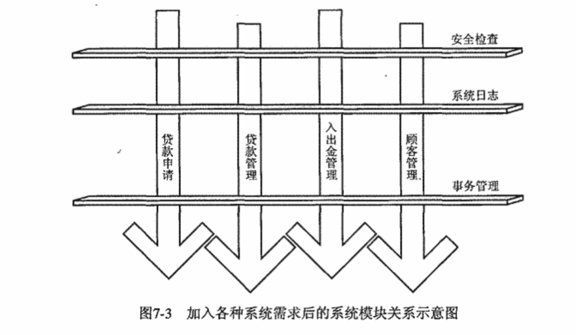
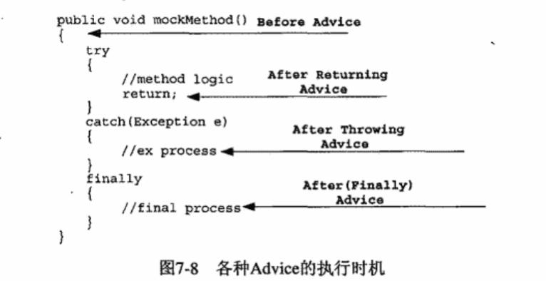
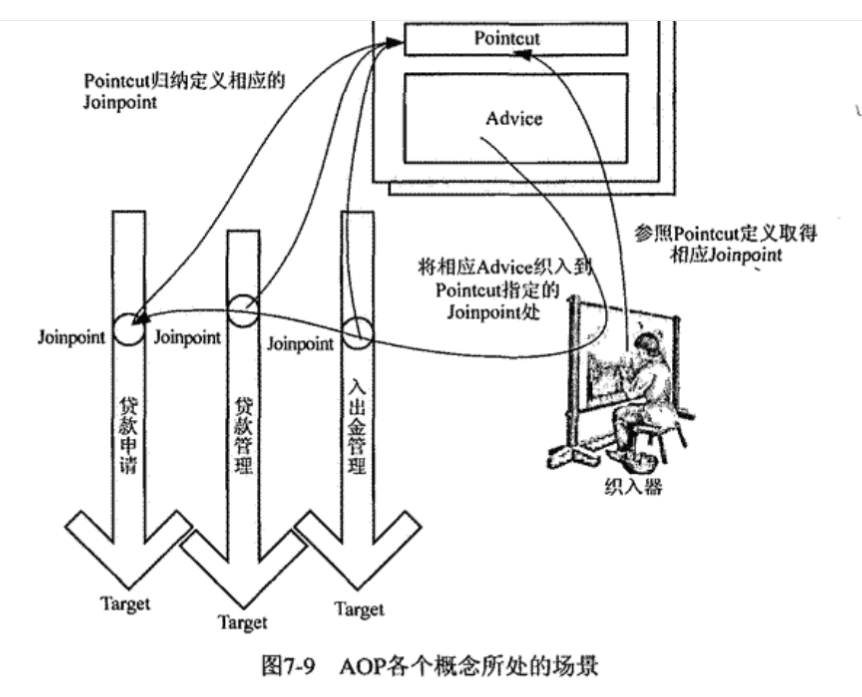
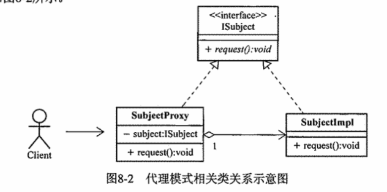
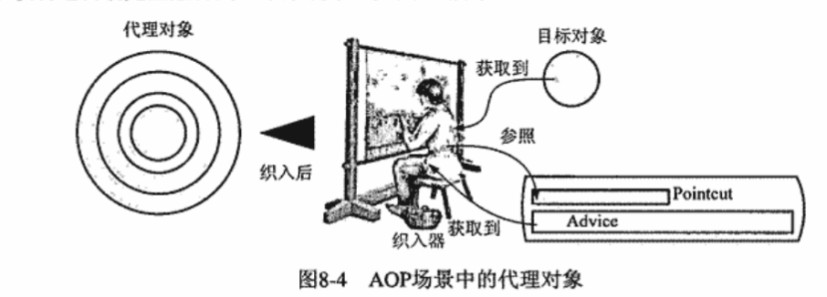

# 一起来看AOP
### 产生原因
软件开发的目的是为了解决各种需求，包括业务需求和系统需求。使用OOP可以对业务需求等普通关注点进行很好的抽象和封装，并且使之模块化。
对于系统需求一类的关注点，情况却有所不同。

将系统需求以面向对象的方式实现并集成到整个系统去，就不是一个需求对应一个实现那么简单。系统中每个业务对象都需要加入日志记录，加入相应的安全检查，需求的实现代码就会遍及所有业务对象。
这样的实现方式会导致业务对象的代码变得臃肿，不易维护，也不利于复用。


> 业务需求：顾客贷款申请、顾客信息管理、贷款信息管理等等
>
> 系统需求：日志功能、权限控制

OOP无法避免系统需求的实现代码遍及所有业务对象，但是AOP可以。

AOP将日志记录、安全检查等系统需求横切到组织良好的业务功能模块之上。
这些系统需求就是AOP中的横切关注点，引入了Aspect的概念对这些横切关注点进行组织和封装。

Aspect对于AOP相当于Class对于Oop，Aspect是AOP的基本组成单元。

AOP是对OOP的一种补足，当我们把以Class形式模块化的业务需求和以Aspect形式模块化的系统需求组织在一起，就可以构成一个完整的系统。


### AOP的尴尬
由于当前技术所限，虽然可以构造出AOP使用的各个积木块，但却无法构建属于AOP的独有空间。因此，AOP的使用者必须将AOP的概念和实现融入到OOP的概念和实现中，这就是AOP的尴尬之处。

### AOP走向现实
将AO组件集成到OOP组件的过程，在AOP称之为织入过程。织入过程是处于AOP、OOP的开发过程之外的，而且对于整个系统的实现是透明的。开发者需要专注于业务需求和系统需求的实现，开发完成后通过织入过程就可以将AOP和OOP组件集成到一起。
#### 静态AOP时代
优点：Aspect直接以java字节码的形式编译到Java类中，Java虚拟机可以像通常一样加载Java类运行，不会对系统性能造成影响。
缺点：灵活性不够，如果横切关注点需要改变织入系统的位置，需要重新修改Aspect的代码，重新编译，重新部署。
#### 动态AOP时代
通过Java语言提供的各种动态特性，可以在运行时动态地将Aspect织入到当前系统的过程。

AOP各种概念实体全部都是普通的Java类，跟Class作为系统的基本组成单元。与静态AOP相比，织入过程在系统运行开始之后进行，而不是预先编译到系统类中，而且织入信息大都采用外部配置的方式，这样可以在运行时动态地改变织入信息，从而实现灵活的AOP。

缺点：性能损失，因为织入过程是在运行时进行的，所以会对系统性能造成一定的影响。

### AOP的实现机制
#### 动态代理
动态代理可以在运行期间，为相应的接口动态生成对应的代理对象。所以我们可以将横切关注点逻辑封装到动态代理的InvocationHandler中，然后将横切关注点逻辑织入到相应的代理类中。以动态代理类作为载体的横切逻辑，就可以在运行期间动态地织入到系统中。

特点：所有需要织入横切关注点逻辑的模块类都需要实现相应的接口，因为动态代理机制只能为接口生成代理类。性能损失，因为动态代理机制是在运行期间动态生成代理类的，所以会对系统性能造成一定的影响。

#### 动态字节码生成
只要交给Java虚拟机运行的文件符合Java Class规范，程序的运行就没有问题。所以我们可以通过Java字节码生成工具，动态地生成Java字节码。为需要织入横切逻辑的模块类在运行期间，通过动态字节码增强技术，为这些系统模块类生成相应的子类，而将横切逻辑加到这些子类中，让应用程序在执行期间使用的是这些子类，从而实现横切逻辑的织入。
Spring AOP在无法采用动态代理机制进行AOP功能拓展的时候，会使用CGlib来实现AOP功能拓展。

#### 自定义类加载器
通过自定义类加载器的方式完成横切逻辑到系统的织入，自定义类加载器通过读取外部文件规定的织入规则和必要信息，在加载class文件期间就可以将横切逻辑添加到系统模块类的现有逻辑中，然后将改动后的class交给java虚拟机运行。

### AOP国家的公民
#### JoinPoint
在系统运行之前，AOP的功能模块需要织入OOP的功能模块中，所以要进行这种织入过程，我们需要知道在系统的哪些执行点进行织入操作，这些将要在其之上进行织入操作的系统执行点，就是JoinPoint。
程序执行过程中的任何时点都可以作为横切逻辑的切入点，而所有这些执行时点都是JoinPoint。

#### Pointcut
Pointcut是JoinPoint的集合，也就是说，Pointcut是一组JoinPoint的集合。Pointcut是通过表达式来定义的，这个表达式可以定义为：在哪些类的哪些方法上进行横切逻辑的织入。
##### Pointcut表述方式
1.直接指定JoinPoint所在方法名称
2.正则表达式。比较普遍的方式，可以通过正则表达式来定义Pointcut，这样可以更加灵活地定义Pointcut。
3.特定的Pointcut表述语言。

Pointcut运算：&&、||、!

#### Advice
Advice是单一横切关注逻辑的载体，它代表将会织入到JoinPoint的横切逻辑。如果将Aspect比作OOP的Class，那么Advice就是Class中的方法。
按照Advice在Joinpoint位置执行时机的差异或者完成功能的不同，Advice可以分为以下几种类型：
1. Before Advice：在JoinPoint之前执行的Advice。通常可以使用Before Advice来进行权限检查、日志记录等工作。
2. After Advice：在JoinPoint之后执行的Advice。通常可以使用After Advice来进行资源清理、日志记录等工作。
   2.1 After Returning Advice：在JoinPoint正常完成之后执行的Advice。
   2.2 After Throwing Advice：在JoinPoint抛出异常之后执行的Advice。
   2.3 After Advice: 该类型不管JoinPoint是否正常完成，都会在JoinPoint之后执行。

3. Around Advice：在JoinPoint之前和之后执行的Advice。 Around Advice对附加其上的JoinPoint进行包裹，可以在JoinPoint执行前后执行一些额外的逻辑，也可以阻止JoinPoint的执行。
#### Aspect
Aspect是对系统中的横切关注点逻辑进行模块化封装的AOP概念实体。通常情况下，Aspect可以包含Pointcut和Advice。
```
aspect AjStyleAspect {
    //pointcut定义
    pointcut query():call(public * get*());
    pointcut update():call(public * update*());
    
    //advice定义
    before():query() {
        System.out.println("before query");
    }
    after() returnInt():query() {
        System.out.println("after query");
    }
}
```
#### 织入和织入器
织入是将Aspect中定义的横切逻辑织入到OOP的功能模块中的过程。完成织入过程的那个组件，就是织入器。
织入器是织入的具体实现，它负责将Aspect中定义的横切逻辑织入到OOP的功能模块中。

不同的AOP实现的织入器形式不一样，但是织入器的功能是一样的，它们都是将Aspect中定义的横切逻辑织入到OOP的功能模块中。

#### 目标对象
符合Pointcut所指定的条件，将在织入过程中被织入横切逻辑的对象，就是目标对象。



## Spring AOP
### Spring AOP的实现机制
采用动态代理机制和字节码生成技术实现AOP。
#### 设计模式-代理模式
代理处在访问者和被访问者之间，可以隔离两者之间的直接交互，访问者与代理打交道就好像在与被访问者打交道一样。
代理可以减少被访问者的负担，另外代理最终要将访问请求转发给真正的被访问者，因此代理可以在访问请求到达被访问者之前做一些额外的事情，例如权限检查、日志记录等。

涉及到的角色：
1. ISubject：该接口是对被访问者或者被访问资源的抽象。
2. SubjectImpl：该类是被访问者或者被访问资源的具体实现。
3. SubjectProxy：该类是代理类，它实现了ISubject接口，同时持有被访问者的引用，它可以在访问请求到达被访问者之前做一些额外的事情，例如权限检查、日志记录等。
4. Client：该类是访问者，它通过代理类来访问被访问者。

SubjectImpl、SubjectProxy都实现了ISubject接口，而SubjectProxy持有了SubjectImpl的引用，因此SubjectProxy可以在访问请求到达SubjectImpl之前做一些额外的事情。

如果SubjectImpl是系统中的JoinPoint所在的对象，即目标对象，那么就可以为这个目标对象创建一个代理对象，然后将横切逻辑添加到这个代理对象中。当系统使用这个代理对象运行的时候，原有逻辑实现和横切逻辑就完全融合到一个系统中。


问题：采用这种静态代理模式，虽然Joinpoint相同(request方法()的执行),但是对应的目标对象类型是不一样的。针对不一样的目标对象类型，需要创建不同的代理对象，这样就会导致代理对象的数量成倍增长，这样的代理对象数量成倍增长的问题，就是Spring AOP的一个重要问题。而实际上这些代理对象所要添加的横切逻辑是一样的，因此这些代理对象的创建是没有必要的。
#### 动态代理模式
动态代理模式可以为指定的接口在系统运行期间动态地生成代理对象，这样就可以避免静态代理模式中代理对象数量成倍增长的问题。

动态代理机制的实现主要由一个类和一个接口组成：即InvocationHandler接口和Proxy类。
虽然要为Isubject和Irequestable两种类型提供代理对象，因为代理对象中要添加的横切逻辑是一样的，所以我们只需要实现一个InvocationHandler接口的实现类，然后为Isubject和Irequestable两种类型的目标对象分别创建一个代理对象即可。

动态代理虽然好，但不能满足所有的需求。因为动态代理机制只能为接口创建代理对象，而不能为类创建代理对象。因此，如果目标对象是一个类，那么就不能使用动态代理机制。
#### CGLIB动态代理
原理：我们可以对目标对象进行继承拓展，为其生成相应的子类，而子类可以通过覆写来拓展父类的行为，只要将横切逻辑的实现放到子类中，然后让系统使用拓展后的目标对象的子类，就可以实现横切逻辑的添加。
我们要借助于CGLIB这样的动态字节码生成库，在系统运行期间动态地为目标对象生成相应的拓展子类。

要对Requestable类进行拓展，直接使用MethodInterceptor接口（实现了Callback接口）
```java
public class RequestCtrlCallback implements MethodInterceptor {

    private Object target;
    public Object intercept(Object o, Method method, Object[] objects, MethodProxy methodProxy) throws Throwable {
        System.out.println("before");
        Object result = methodProxy.invokeSuper(o, objects);
        System.out.println("after");
        return result;
    }
}
```
这样，RequestCtrlCallback就实现了对request()方法请求进行访问控制的逻辑，要通过CGLIB的Enhancer为目标对象动态地生成一个子类，然后将RequestCtrlCallback中的横切逻辑附加到子类中，这样就可以实现对目标对象的拓展。
```
        Enhancer enhancer = new Enhancer();
        enhancer.setSuperclass(Requestable.class);
        enhancer.setCallback(new RequestCtrlCallback());

        Requestable proxy = (Requestable) enhancer.create();
        proxy.request();
```
使用CGLIB动态代理的优点是：无法对final方法进行重写。
