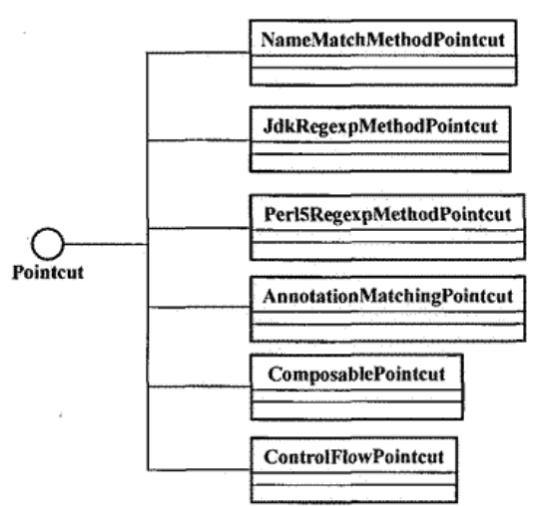
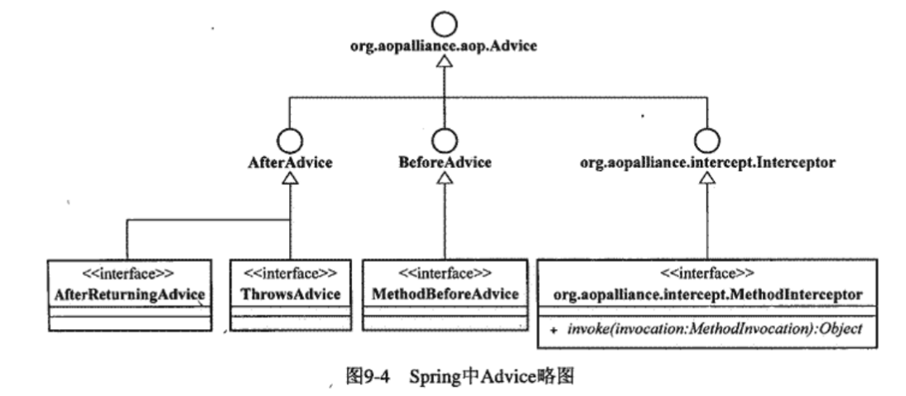
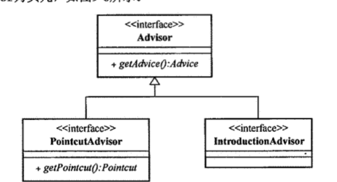

### Spring AOP
#### JoinPoint
Spring AOP仅支持方法级别的连接点。
原因：
1. KEEP IT SIMPLE, STUPID
2. 对于类中属性的连接点，因为属性的值可能在任何时候被修改，破坏了面向对象的封装性。

#### Pointcut
Spring中以接口定义PointCut作为AOP框架中所有Pointcut的最顶层抽象，该接口定义了两个方法来帮助捕捉系统中的相应JoinPoint,并提供了一个TruePointcut实现，该实现总是返回true，即捕捉所有的JoinPoint。
Pointcut接口定义如下：
```java
public interface Pointcut {
    ClassFilter getClassFilter();
    MethodMatcher getMethodMatcher();
    Pointcut TRUE = TruePointcut.INSTANCE;
}
```
##### ClassFilter
ClassFilter接口定义了一个matches方法，用于判断目标类是否匹配，如果匹配则返回true，否则返回false。
```java
public interface ClassFilter {
    boolean matches(Class<?> clazz);
    ClassFilter TRUE = TrueClassFilter.INSTANCE;
}
```
如果需要匹配所有的类，则可以使用TrueClassFilter实现，该实现总是返回true。
##### **MethodMatcher**
MethodMatcher接口定义了三个方法，用于判断目标方法是否匹配，如果匹配则返回true，否则返回false。
```java
public interface MethodMatcher {
    boolean matches(Method method, Class<?> targetClass);
    boolean isRuntime();
    boolean matches(Method method, Class<?> targetClass, Object... args);
    MethodMatcher TRUE = TrueMethodMatcher.INSTANCE;
}
```
MethodMatcher通过重载，定义了两个matches方法，而这两个方法的分界线就是isRuntime方法，在对对象具体方法进行拦截的时候，可以忽略每次方法执行的时候调用者传入的参数，也可以每次都检查这些方法调用参数，以强化拦截条件。
在MethodMatcher类型的基础上，Spring AOP提供了两个实现，分别是StaticMethodMatcher和DynamicMethodMatcher。

##### 常见的Pointcut实现

1. NameMatchMethodPointcut
这是最简单的Pointcut实现，它通过方法名来匹配目标方法，可以根据自身指定的一组方法名称与JoinPoint的方法名称进行匹配。
```
        NameMatchMethodPointcut pointcut = new NameMatchMethodPointcut();
        pointcut.setMappedName("test");
        //传入多个方法名
        pointcut.setMappedNames("test", "test2");
```
还可以使用*通配符以及正则表达式，实现简单的模糊匹配。
```
        pointcut.setMappedName("test*");
```
2. JdkRegexpMethodPointcut
子类中有一个专门用于匹配方法名的正则表达式属性，可以使用正则表达式来匹配方法名。
```
        JdkRegexpMethodPointcut pointcut = new JdkRegexpMethodPointcut();
        pointcut.setPattern(".*test.*");
```
3. Perl5RegexpMethodPointcut
这个类与JdkRegexpMethodPointcut类似，只是使用的是Perl5的正则表达式。
```
        Perl5RegexpMethodPointcut pointcut = new Perl5RegexpMethodPointcut();
        pointcut.setPattern(".*test.*");
```
4. AnnotationMatchingPointcut
根据目标对象的方法上是否存在指定的注解来匹配方法，要使用该类型的Pointcut，首先需要声明相应的注解。
```用于Pointcut的ClassLevelAnnotation注解
@Target(ElementType.TYPE)
@Retention(RetentionPolicy.RUNTIME)
public @interface ClassLevelAnnotation {
}
```
```用于Pointcut的MethodLevelAnnotation注解
@Target(ElementType.METHOD)
@Retention(RetentionPolicy.RUNTIME)
public @interface MethodLevelAnnotation {
}
```
然后在目标对象的类上添加ClassLevelAnnotation注解，方法上添加MethodLevelAnnotation注解。

不同的AnnotationMatchingPointcut只指定类级别的注解，或者方法级别的注解，或者两者都指定，这样就可以实现不同的匹配规则。
```
        AnnotationMatchingPointcut pointcut = new AnnotationMatchingPointcut(ClassLevelAnnotation.class);
        AnnotationMatchingPointcut pointcut2 = new AnnotationMatchingPointcut(MethodLevelAnnotation.class);
        AnnotationMatchingPointcut pointcut3 = new AnnotationMatchingPointcut(ClassLevelAnnotation.class, MethodLevelAnnotation.class);
```

5. ComposablePointcut
ComposablePointcut是一个组合Pointcut，它可以将多个Pointcut组合成一个Pointcut，这样就可以实现复杂的匹配规则。
```
        ComposablePointcut pointcut = new ComposablePointcut();
        pointcut.intersection(new NameMatchMethodPointcut("test"));
        pointcut.intersection(new AnnotationMatchingPointcut(ClassLevelAnnotation.class));
```
6. ControlFlowPointcut
略

##### IoC容器中的Pointcut
Spring中的Poincut实现都是普通的Java对象，我们同样可以通过Spring的IoC容器来注册并使用它们。
```
        ApplicationContext context = new ClassPathXmlApplicationContext("classpath:applicationContext.xml");
        Pointcut pointcut = (Pointcut) context.getBean("pointcut");
```
applicationContext.xml配置文件中的pointcut bean定义如下：
```
    <bean id="pointcut" class="org.springframework.aop.support.NameMatchMethodPointcut">
        <property name="mappedName" value="test"/>
    </bean>
```

#### Spring AOP的Advice
Advice实现了将被织入到Pointcut规定的JoinPoint处的横切逻辑。在Spring中，Advice按照其自身实例能否在目标对象类的所有实例中能否共享这一标准，可以划分两大类：单例Advice和原型Advice。
##### per-class类型的Advice
per-class类型的Advice是指Advice实例在目标对象类的所有实例中都是同一个实例，通常只提供方法拦截的功能，不会为目标对象类保存任何状态或者添加新的特性。



###### BeforeAdvice
BeforeAdvice所实现的横切逻辑将在相应的Joinpoint之前执行，在Before Advice执行完成之后，程序执行流程将从Joinpoint处继续执行。

我们可以使用BeforeAdvice接口的实现类MethodBeforeAdviceInterceptor来实现BeforeAdvice接口，MethodBeforeAdviceInterceptor的构造函数接受一个MethodBeforeAdvice类型的参数，MethodBeforeAdvice接口只有一个方法before，该方法的参数与BeforeAdvice接口的before方法的参数一致。
```
        MethodBeforeAdvice methodBeforeAdvice = new MethodBeforeAdvice() {
            @Override
            public void before(Method method, Object[] args, Object target) throws Throwable {
                System.out.println("before advice");
            }
        };
        BeforeAdvice beforeAdvice = new MethodBeforeAdviceInterceptor(methodBeforeAdvice);
```
我们可以使用Before Advice进行整个系统的某些资源初始化或者其他一些准备性的工作。
```java
public class ResourceSetupBeforeAdvice implements MethodBeforeAdvice {
    private Resource resource;

    public ResourceSetupBeforeAdvice(Resource resource) {
        this.resource = resource;
    }

    @Override
    public void before(Method method, Object[] args, Object target) throws Throwable {
        if (!resource.exists()) {
            resource.getFile().mkdirs();
        }
    }
}

```
###### ThrowsAdvice
ThrowsAdvice所实现的横切逻辑将在相应的Joinpoint抛出异常时执行。我们可以根据将要拦截的Throwable的不同类型，在同一个ThrowsAdvice中实现多个afterThrowing方法。框架将会使用Java反射机制来调用这些方法。
```java
//声明了多个afterThrowing方法的ThrowsAdvice定义
public class ExceptionHandlerThrowsAdvice implements ThrowsAdvice {
    public void afterThrowing(Exception ex) {
        System.out.println("exception handler");
    }

    public void afterThrowing(IOException ex) {
        System.out.println("io exception handler");
    }

    public void afterThrowing(NullPointerException ex) {
        System.out.println("null pointer exception handler");
    }
}
```

###### AfterReturningAdvice
通过Spring中的AfterReturningAdvice接口，我们可以访问当前Joinpoint的方法返回值、方法、方法参数以及目标对象。我们可以使用AfterReturningAdvice接口的实现类MethodAfterReturningAdviceInterceptor来实现AfterReturningAdvice接口，MethodAfterReturningAdviceInterceptor的构造函数接受一个AfterReturningAdvice类型的参数，AfterReturningAdvice接口只有一个方法afterReturning，该方法的参数与AfterReturningAdvice接口的afterReturning方法的参数一致。

因为只有方法正常返回的情况下，AfterReturningAdvice才会执行，所以用来处理资源清理之类的工作并不合适。

为了便于运营人员验证系统状态，批处理程序在正常完成之后回往数据库的指定表中插入运行状态信息。我们可以通过验证这些状态判断批处理任务是否成功执行。

```java
public class BatchStatusAfterReturningAdvice implements AfterReturningAdvice {
    private JdbcTemplate jdbcTemplate;

    public BatchStatusAfterReturningAdvice(JdbcTemplate jdbcTemplate) {
        this.jdbcTemplate = jdbcTemplate;
    }

    @Override
    public void afterReturning(Object returnValue, Method method, Object[] args, Object target) throws Throwable {
        jdbcTemplate.update("insert into batch_status values(?)", new Object[]{new Date()});
    }
}
```

###### AroundAdvice
Spring AOP没有提供AfterAdvice接口，使得我们没有一个合适的Advice类型来承载类似于系统资源清楚之类的横切逻辑。Spring AOP的AfterReturningAdvice不能更改Joinpoint所在方法的返回值，使得我们在方法正常返回后无法对其进行更多干预。可以用AroundAdvice来实现这样的功能。

Spring中没有直接定义对应Around Advice的接口，但是我们可以通过实现MethodInterceptor接口来实现Around Advice。
```java
public interface MethodInterceptor extends Interceptor {
    Object invoke(MethodInvocation invocation) throws Throwable;
}
```
Around Advice能够完成的事情，Before Advice、AfterReturning Advice和Throws Advice都能完成，但是Around Advice可以更加灵活地控制Joinpoint的执行。Around Advice可以在Joinpoint执行之前和之后执行一些逻辑，也可以在Joinpoint执行之前阻止其执行，或者在Joinpoint执行之后修改其返回值。

```java 简单的检测系统某些方法的执行性能
@Slf4j
public class PerformanceMethodinterceptor implements MethodInterceptor {


    @Override
    public Object invoke(MethodInvocation invocation) throws Throwable {
        StopWatch watch = new StopWatch();
        try {
            watch.start();
            return invocation.proceed();
        }
        finally {
            watch.stop();
            if (log.isInfoEnabled()) {
                Method method = invocation.getMethod();
                log.info("执行方法[" + method.getName() + "]耗时[" + watch.getTotalTimeMillis() + "]ms");
            }
        }
    }
}
```
通过MethodInvocation参数，我们可以控制对对应JoinPoint的拦截行为。通过调用proceed()方法，我们可以让JoinPoint继续执行，如果不调用proceed()方法，JoinPoint将不会执行。通过调用proceed()方法，我们可以让程序执行执行继续沿着调用链传播，这是通常我们所希望的行为。如果我们在哪一个MethodInterceptor中调用了proceed()方法，那么程序将会继续执行下一个MethodInterceptor，直到执行完所有的MethodInterceptor，然后再执行JoinPoint。如果我们在哪一个MethodInterceptor中没有调用proceed()方法，那么程序将在当前的MethodInterceptor中终止，不会执行后续的MethodInterceptor处短路，JoinPoint调用链将被中断。同一个JoinPoint的其他MethodInterceptor的逻辑以及JoinPoint本身的逻辑都不会被执行。

除非你真的知道自己在做什么，否则不要忘记调用proceed()方法。

正如PerformanceMethodinterceptor所示，我们可以在proceed()方法，也就是在Joinpoint处的逻辑执行之前和之后执行一些逻辑。在proceed()方法之前执行的逻辑，就是Before Advice的逻辑，而在proceed()方法之后执行的逻辑，就是AfterReturning Advice的逻辑。如果在proceed()方法之前执行的逻辑中抛出了异常，那么proceed()方法将不会被执行，而是直接进入到AfterThrowing Advice的逻辑中。如果在proceed()方法之后执行的逻辑中抛出了异常，那么这个异常将会被抛出，而不会被AfterThrowing Advice捕获。

进一步演示MethodInterceptor的使用，我们可以设想商场打折的场景，假设商场在周末打8折，那么我们可以通过在系统中所有取得商品价格的位置插入这样的横切逻辑。之后AfterReturningAdvice无法做的事情，使用Around Advice就可以做到了。

```
    // 打折比例
    public static final Integer DEAFULT_DISCOUNT_RATIO = 80;

    private Integer discountRatio = DEAFULT_DISCOUNT_RATIO;
    private boolean campaignAvailable;

    @Override
    public Object invoke(MethodInvocation invocation) throws Throwable {
        Object returnValue = invocation.proceed();
        if (campaignAvailable) {
            returnValue = (Double) returnValue * discountRatio / 100;
        }
        return returnValue;
    }
```
```
    @Test
    public void test() {
        DiscountMethodInterceptor discountMethodInterceptor = new DiscountMethodInterceptor();
        discountMethodInterceptor.setDiscountRatio(80);
        discountMethodInterceptor.setCampaignAvailable(true);
//        discountMethodInterceptor.setTarget(new Market());
//        Market market = (Market) discountMethodInterceptor.getProxy();
//        market.sell();
    }
```
使用Spring框架可以将这些Advice实现集成到IoC容器中，例如
    
    ```
        @Bean
        public DiscountMethodInterceptor discountMethodInterceptor() {
            DiscountMethodInterceptor discountMethodInterceptor = new DiscountMethodInterceptor();
            discountMethodInterceptor.setDiscountRatio(80);
            discountMethodInterceptor.setCampaignAvailable(true);
            return discountMethodInterceptor;
        }
    ```
    ```
        @Bean
        public Market market() {
            Market market = new Market();
            ProxyFactory proxyFactory = new ProxyFactory(market);
            proxyFactory.addAdvice(discountMethodInterceptor());
            return (Market) proxyFactory.getProxy();
        }
    ```

##### per-instance类型的Advice
per-instance类型的Advice不会在目标类所有对象实例之间共享，而是会为不同的实例对象保存它们各自的状态以及相关逻辑。

每一名员工是员工类的不同实例，每个员工上班之前，公司设置了per-class类型的Advice进行上班活动的拦截，即打卡机，所有员工公用一个打卡机。当员工开始工作的时候，会使用类似的per-instance类型的Advice进行Github的提交，每个员工都有自己的Github账号，每个员工的Github账号都是不同的。

Spring AOP中，Introduction就是唯一的一种per-instance类型的Advice。

Introduction可以在不改动目标类定义的情况下， 为目标类添加新的属性以及行为。

在Spring中，为目标对象添加新的属性和行为必须声明相应的接口以及相应的实现类，然后通过IntroductionInterceptor拦截器将新的接口定义以及实现类中的逻辑附加到目标对象之上，目标对象就拥有了新的状态和行为。

```java
public interface IntroductionInterceptor extends MethodInterceptor, DynamicIntroductionAdvice {
}
```
DynamicIntroductionAdvice用于界定IntroductionInterceptor为哪些接口类提供相应的拦截功能。
```java
public interface DynamicIntroductionAdvice extends Advice {
    boolean implementsInterface(Class<?> intf);
}
```

如果把每个目标对象实例都看作生产线上的牛奶，那么生产合格证就是新的属性，生产合格证的检查就是新的行为，IntroductionInterceptor就是执行这个操作的那个“人”，那么我们就可以通过IntroductionInterceptor来实现生产合格证的检查。

#### Spring AOP的Aspect
Aspect负责将Pointcut和Advice分门别类地装进箱子。

Advisor代表Spring的Aspect，但通常只持有一个Pointcut和一个Advice.

Advisor体系结构


##### PointcutAdvisor
大部分实现全都是PointcutAdvisor的部下。

1. DefaultPointcutAdvisor
```java
public class DefaultPointcutAdvisor extends AbstractGenericPointcutAdvisor implements Serializable {
    private Pointcut pointcut;

    public DefaultPointcutAdvisor() {
        this.pointcut = Pointcut.TRUE;
    }

    public DefaultPointcutAdvisor(Advice advice) {
        this(Pointcut.TRUE, advice);
    }

    public DefaultPointcutAdvisor(Pointcut pointcut, Advice advice) {
        this.pointcut = Pointcut.TRUE;
        this.pointcut = pointcut;
        this.setAdvice(advice);
    }

    public void setPointcut(@Nullable Pointcut pointcut) {
        this.pointcut = pointcut != null ? pointcut : Pointcut.TRUE;
    }

    public Pointcut getPointcut() {
        return this.pointcut;
    }

    public String toString() {
        String var10000 = this.getClass().getName();
        return var10000 + ": pointcut [" + this.getPointcut() + "]; advice [" + this.getAdvice() + "]";
    }
}
```
2. RegexpMethodPointcutAdvisor
```java
public class RegexpMethodPointcutAdvisor extends AbstractGenericPointcutAdvisor {
    @Nullable
    private String[] patterns;
    @Nullable
    private AbstractRegexpMethodPointcut pointcut;
    private final Object pointcutMonitor = new SerializableMonitor();

    public RegexpMethodPointcutAdvisor() {
    }

    public RegexpMethodPointcutAdvisor(Advice advice) {
        this.setAdvice(advice);
    }

    public RegexpMethodPointcutAdvisor(String pattern, Advice advice) {
        this.setPattern(pattern);
        this.setAdvice(advice);
    }

    public RegexpMethodPointcutAdvisor(String[] patterns, Advice advice) {
        this.setPatterns(patterns);
        this.setAdvice(advice);
    }

    public void setPattern(String pattern) {
        this.setPatterns(pattern);
    }

    public void setPatterns(String... patterns) {
        this.patterns = patterns;
    }

    public Pointcut getPointcut() {
        synchronized(this.pointcutMonitor) {
            if (this.pointcut == null) {
                this.pointcut = this.createPointcut();
                if (this.patterns != null) {
                    this.pointcut.setPatterns(this.patterns);
                }
            }

            return this.pointcut;
        }
    }

    protected AbstractRegexpMethodPointcut createPointcut() {
        return new JdkRegexpMethodPointcut();
    }

    public String toString() {
        String var10000 = this.getClass().getName();
        return var10000 + ": advice [" + this.getAdvice() + "], pointcut patterns " + ObjectUtils.nullSafeToString(this.patterns);
    }

    private static class SerializableMonitor implements Serializable {
        private SerializableMonitor() {
        }
    }
}
```
RegexpMethodPointcutAdvisor是一个PointcutAdvisor的实现，它的作用是将一个Advice和一个Pointcut关联起来，这个Pointcut是一个RegexpMethodPointcut的实现，它的作用是匹配方法名是否符合正则表达式。
3. NameMatchMethodPointcutAdvisor
```java
public class NameMatchMethodPointcutAdvisor extends AbstractGenericPointcutAdvisor {
    private final NameMatchMethodPointcut pointcut = new NameMatchMethodPointcut();

    public NameMatchMethodPointcutAdvisor() {
    }

    public NameMatchMethodPointcutAdvisor(Advice advice) {
        this.setAdvice(advice);
    }

    public void setClassFilter(ClassFilter classFilter) {
        this.pointcut.setClassFilter(classFilter);
    }

    public void setMappedName(String mappedName) {
        this.pointcut.setMappedName(mappedName);
    }

    public void setMappedNames(String... mappedNames) {
        this.pointcut.setMappedNames(mappedNames);
    }

    public NameMatchMethodPointcut addMethodName(String name) {
        return this.pointcut.addMethodName(name);
    }

    public Pointcut getPointcut() {
        return this.pointcut;
    }
}
```

NameMatchMethodPointcutAdvisor是一个Advisor，它持有一个NameMatchMethodPointcut，NameMatchMethodPointcut是一个Pointcut，实际上是操作所持有的这个NameMatchMethodPointcut实例。
##### IntroductionAdvisor
与PointcutAdvisor最本质上的区别就是IntroductionAdvisor持有的Advice是一个IntroductionInterceptor，也就是说，IntroductionAdvisor纯粹是为了Introduction而生的。

#### Ordered的作用
系统中只存在单一的横切关注点的情况比较少，大多时候都会有多个横切关注点需要处理，系统中就会有多个Advisor存在。当某些Advisor的Pointcut匹配到了某个方法时，就会在同一个Joinpoint执行这个Advisor所持有的Advice，这个时候就需要一个顺序来决定执行的顺序，否则系统的行为就会偏离我们的预想，这个顺序就是Ordered的作用。

假设有两个Advisor，一个进行权限检查，当检查到当前调用没有权限的时候，抛出相应异常；另一个使用一个ThrowsAdvice对系统中的所有异常检测的异常进行拦截。

Spring在处理同一个Joinpoint处的多个Advisor的时候，实际上会按照指定的顺序和优先级来执行它们，顺序号决定优先级，顺序号越小，优先级越高。默认情况下，我们不明确指定各个Advisor的执行顺序，那么Spring会按照它们的声明顺序来应用它们。最先声明的Advisor的优先级最高，最后声明的Advisor的优先级最低

如果顺序不当就会导致，已经经过ThrowsAdvice处理过的异常，再次被权限检查的Advisor处理，这样就会导致异常被抛出，而不是被ThrowsAdvice处理。

### Spring AOP的织入
Spring AOP的织入是在Spring容器初始化的时候完成的，Spring AOP的织入是通过AopProxyFactory来完成的。ProxyFactory是最基本的一个织入器实现。

#### 如何和ProxyFactory打交道
SpringAOP是基于代理模式的AOP实现，织入过程完成后，会返回织入了横切逻辑的目标对象的代理对象。
```
ProxyFactory weaver = new ProxyFactory(yourTargetObject);
Advisor advisor = new DefaultPointcutAdvisor(pointcut, advice);
weaver.addAdvisor(advisor);
Object proxy = weaver.getProxy();
//现在可以使用proxy对象了
```
使用ProxyFactory来织入横切逻辑，

1. 首先需要创建一个ProxyFactory实例，然后将目标对象设置到ProxyFactory中，
2. 然后将Advisor添加到ProxyFactory中，最后调用ProxyFactory的getProxy()方法来获取代理对象。
    2.1 还可以使用weaver.addAdvice(advice)直接指定各种类型的Advice。

##### 基于接口的代理
